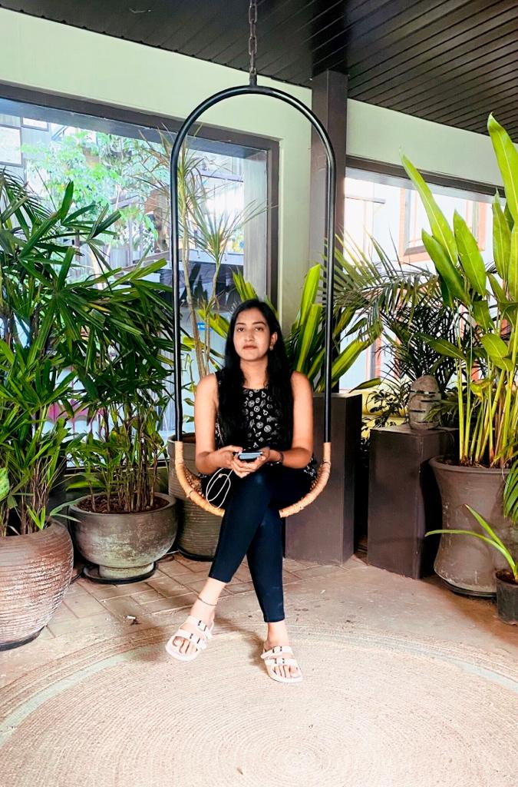

# Mahitha sri Kurri
I have completed my bachelor's degree in Electronics and communication from Vignans lara institute of science and technology. My education has provided me with a solid foundation in programming, problem-solving, and software development. In addition to my academic pursuits, I am also deeply passionate about my hobbies like watching tv,reading books. 

---
# Tables

Here is the list of sports, I would recommend someone to try because playing sports improve physical fitness and mental health.

| S.No  | Sport Name|
| ------- | ------- |
| 1  | Cricket      |
| 2  | Foot Ball    |
| 3  | Basketball   |
| 4  | Tennis       |

| Sport              |  Reason                              | Average Weekly Time (Hrs) |
| -------------------| --------------------------------------------------| ------------------------------ |
| Cricket             |  Improves agility and cardiovascular fitness. | 2                         |
| Football            | Promotes teamwork, coordination, and endurance.   | 4                     |
| Basketball          | Perfect for overall fitness. | 3                          |
| Tennis             | Relieve stress.         | 1                          |

---
# Two Pithy quotes

> "In the middle of every difficulty lies opportunity" - *Albert Einstein*

> "Your time is limited, don't waste it living someone else's life." - *Steve Jobs*

